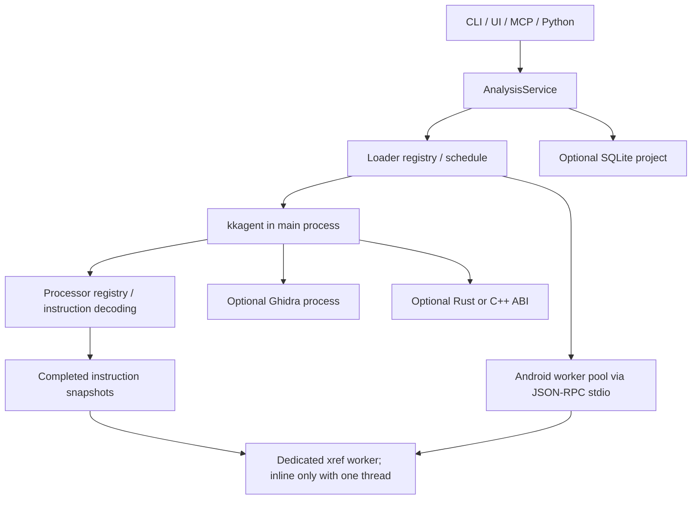

# Fangida architecture — v0.4 implementation record

Date: 2026-09-30. The v0.1 design described an intended complete reverse
engineering platform. This document records the implemented v0.4 boundary and
the evidence still needed before broader claims can be made.

## 模块和兼容契约

加载器、处理器、插件接口分别开发与注册，分析编排通过公共模型连接它们：

| 模块 | 职责 | 扩展入口 |
| --- | --- | --- |
| `fangida.loaders` | 文件识别、ELF/PE/Mach-O 容器结构、代码区域与地址映射；JVM/DEX/ZIP 提供识别探针 | `Loader`、`LoaderRegistry` |
| `fangida.processors` | 根据架构和端序解码给定字节窗口，输出统一指令记录 | `InstructionDecoder`、`ProcessorRegistry`、`register_processor` |
| `fangida.plugins.interfaces` | 定义分析插件的能力、分析调用和生命周期 | `Plugin`；`PluginManager` 负责延迟加载 |
| `fangida.xrefs` | 消费完成的指令/调用快照，构建、合并和索引引用 | `XrefStage` |

加载器不导入解码器或语义分析器；处理器不选择文件格式或构建引用图。内置插件
负责连接各阶段。注册新的加载器、处理器时不需要把实现加进其他模块的条件分支。

插件使用 `PluginManager.register(name, factory, kinds=..., pool=...)` 显式注册，
`route(kind)` 返回插件与资源池，工厂在首次使用时才调用。默认拒绝覆盖已有名称
和格式路由；替换格式路由需要显式设置 `replace_routes=True`，并且原插件尚未
加载。注册不会自动扫描、导入、安装或启动独立项目，集成入口由调用方控制。
结果 schema 的 `kind`、`analyzer` 接受非空字符串，以容纳注册扩展，同时保留
原有内置值与结果字段。

公共 API 按“只增不删”维护。模块拆分保留
`fangida.core.kkagent.binary`、`fangida.core.kkagent.translator`、
`fangida.dispatcher.identify` 和 `fangida.plugins.manager.Plugin` 的旧导入入口。
已有位置参数保持顺序，已有参数名称、返回字段、MCP 工具名称继续可用；新增
参数必须有默认值，新增结果字段必须允许旧构造调用。只有 `analyze(task)` 的旧
插件可以继续运行；进度和取消接口由插件选择实现。

`tests/test_api_compatibility.py` 保存拆分前的明确基线，验证旧 Python 调用、
模型字段、JSON 格式、MCP 工具/握手与命令入口。基线允许增量扩展；不能为了
通过重构而删除原有契约条目。

这些项目约束同时记录在仓库根目录 `AGENTS.md`，供后续模块开发和重构遵守。

## Layers and process boundaries

| Layer | Implemented behavior | Remaining boundary |
| --- | --- | --- |
| Access | JSON CLI, terminal browser, optional modular Tk workbench with IDA-style navigation, Python snapshot/script APIs, MCP stdio and request/response HTTP | No debugger or full interactive decompiler |
| Scheduling | Independent loader and processor registries, lazy built-in plugins, validated settings, bounded IO/parse/analyze/native queues | No OS-enforced quota for every analysis component |
| Native `kkagent` | ELF/PE/thin Mach-O parsing and one selected fat Mach-O slice, bounded disassembly and CFG traversal, direct calls/xrefs, limited register liveness, eligible sized-symbol and direct-call function batches on semantic threads, independent snapshot-based pseudo-C plugin; in full mode, built-in Capstone decoding of at least 256 KiB of executable bytes runs in at most N supervised decode child processes (processor layer only, byte-identical to serial decoding, silent in-process fallback), while CFG, xrefs and plugins stay in the main process | No simultaneous multi-slice analysis, complete function recovery, indirect call resolution, precise interprocedural data flow or source-level C recovery; decode child processes need a locatable, non-frozen Python interpreter and are not used for objdump or registered processors |
| Android `apk_analyzer` | Pool of separate persistent workers for concurrent files, DEX/JVM structure, bytecode and call evidence, Kotlin metadata extraction, bytecode-derived outlines | Members of one APK/JAR remain sequential; no reconstructed Java/Kotlin source, dynamic dispatch resolution or complete call graph |
| Persistence | Content-addressed SQLite snapshots, pagination, history and per-content-hash rename/comment annotations | No automatic cache reuse during analysis or collaborative sync |
| Optional adapters | Installed Ghidra headless supplement; alternative Rust/C++ C ABI histogram/string scanners | Ghidra is external; native ABI has no CFG/semantic implementation |

Both built-in cores implement the same `Plugin` contract and do not import one
another. Shared JSON-compatible `AnalysisTask` and `AnalysisResult` live in
`fangida.models`; the result schema is
[`schemas/analysis-result.schema.json`](../schemas/analysis-result.schema.json).
An inspection can be useful while `status` remains `partial`; warnings and
per-function `source`, `boundary_known`, `analysis_scope`, and graph `frontier`
fields indicate what evidence supports a result.



`identify()` reads a short prefix. ELF, PE, Mach-O, DEX and JVM class magic
normally decide the route; ZIP identification also uses `.apk` to distinguish
an APK from a JAR provisionally. The `cafebabe` collision is checked using the
following word to distinguish a plausible fat Mach-O architecture count from
a JVM class header. A fat Mach-O parser selects one file-backed slice within
the scan budget, preferring ARM64 or x86-64 if present. Unknown files go to a
tentative native scan. APK/JAR members are read in memory without extracting
archive paths.

## Native analysis

### 原生 full 模式与测量边界

`full_analysis` 是追加的可选布尔参数，配置默认 false。CLI/GUI 的 `--full`
请求文件中实际存储的所有可执行区域反汇编、函数恢复、CFG 和 xref；旧默认模式及
参数继续可用。服务在 full 模式默认读取整个文件，显式 `max_bytes` 仍限制
输入读取，并在覆盖记录中保留缺口。当前只接受 ELF、PE、Mach-O；胖 Mach-O
仍选择一个切片。外部反编译器不是此模式的必需步骤。

`metadata.full_analysis` 包含 `scope`、`executable_bytes`、`decoded_bytes`、
`decode_complete`、`instruction_count`、`unassigned_instructions`、
`function_recovery_complete` 和逐区域 `regions`；
`metadata.full_disassembly` 保存全区域指令。恢复函数、直接引用与可解析的
PC 相对数据引用仍有证据边界。解码覆盖完成不能证明所有字节都是代码、所有
函数和间接目标都被恢复，故 `function_recovery_complete` 保留 false，状态
可以继续为 `partial`。

`stats.phase_seconds` 分开记录 `disassembly`、`xref`、`function_recovery`、
`cfg`、`xref_index` 和 `total`。xref 始终消费完成的指令快照，full 模式也遵守
单独线程与预算规则。阶段时间可能包含等待，不能直接当成各阶段 CPU 时间。

内置 Capstone 快路径的解码以 Python 开销为主，在启用 GIL 的解释器上多个区域线程
并发只会互相争用 GIL。因此 full 解码在同时满足以下条件时改由解码子进程并行完成：
有效解码 worker 数 ≥ 2；镜像架构使用内置 `NativeDecoder` 且 Capstone 可用（没有
注册替换的处理器或替换快路径，也不是 objdump 回退）；文件中可执行字节总数
≥ 256KiB；不是冻结构建（`sys.frozen`），`sys.executable` 是可定位的 Python
解释器且包以目录形式安装。自动模式下环境变量 `FANGIDA_DECODE_PROCESSES` 为 `0`
（或 false/no/off）时关闭，为正整数 N 时作为子进程数上限；自动模式还以可用 CPU
数为上限，子进程数始终不超过解码 worker 数。`stream_decode_regions` 新增可选参数
`processes`（None 自动，False 关闭，True 忽略环境变量）和 `diagnostics`（传入的
字典写入 `processes_used` 与 `process_regions`），进度事件同时带 `processes_used`。

线性扫描以 Loader 声明的函数入口和入口点作为重同步锚点。`analyze_full` 从
`image.functions` 的起点（符号表、`LC_FUNCTION_STARTS` 等）与 `image.entry_address`
取得地址，经 `stream_decode_regions` 新增的可选参数 `anchors`（默认 None，扫描与以前
完全相同）交给处理器层；处理器只接收地址列表，不导入 Loader。解码出的指令若跨越锚点
（`addr < 锚点 < addr+size`）——典型情形是前一个函数以不返回调用结尾、其后的零填充被
解成一条覆盖下一个入口序言的假指令——该指令连同同一窗口中其后的指令被丢弃，
`[addr, 锚点)` 记为原因 `anchor_resync` 的缺口，扫描从锚点开新窗口继续。处理器在
列表中跳过的字节、objdump 式整窗口步进同样不越过锚点（缺口只记到锚点）。区域起点、
文件内容之外的地址被忽略；ARM/ARM64 只保留落在 4 字节扫描网格上的地址，网格上的锚点
不会被定长指令跨越，因此 ARM 结果不变，网格外的地址（例如带 Thumb 位的符号）不会让
后续扫描失去对齐。出现重同步缺口的区域 `complete=false`（`partial_reason` 仍为
`uncovered bytes`），并追加告警 “Linear sweep discarded instructions crossing
resynchronization anchors…”。由此，声明的入口总是指令边界，不再因扫描相位被标为
`analysis_scope="not_decoded"`，其 CFG 与不返回分析（以及调用者的不返回截断）照常进行；
声明入口原本都已是指令边界的输入，结果逐字节不变。

多进程切块使用与串行完全相同的锚点：作业可带第 7 项块内锚点（解码子进程协议版本 3，
不带锚点的作业仍是原六元组），子进程把每次重同步记为不合并的
`(起点, 字节数, "anchor_resync")` 三元组缺口；父进程判断“真实游标是否落在块的扫描路径上”
时只把三元组缺口的起点视为路径（缺口内部是一步跳过的），提交时按原因写入覆盖并由
`_gap` 合并相邻同因缺口，因此 records、gaps 与 coverage 仍与串行逐字节一致。若定长指令
集的不可解码步进会越过网格外锚点（正常输入不会出现），子进程把该区域交回进程内串行循环。

### 渐进式结果与批量阶段的 GC

`AnalysisService.analyze` 新增可选参数 `on_preview`。完整分析解码完成后，分析线程会同步调用它一次，
传入一个只读的部分结果（`status="partial"`，`stats.full_preview=True`）：其中包含全部指令
（与最终结果共享同一个只读列表）、区段、符号、字符串，以及不依赖 xref 的声明函数（符号、
unwind 表、入口与区域起点），这些函数尚无 CFG。xref 推出的调用目标函数、CFG、xref 索引
与伪 C 仍按原流程在最终结果中给出，最终结果与不传 `on_preview` 时逐字节一致。回调应尽快
返回（GUI 只是转交给独立的 `fangida-gui-preview` 线程准备表格）；回调抛出的异常只记为警告。
插件管理器只把 `on_preview` 转发给 `analyze_with_control` 接受该参数的插件，其它插件不受影响。
GUI 完整分析会先显示预览（保持忙碌状态，可浏览但不能保存或编辑），最终结果到达后自动替换，
并保留当前浏览位置；最终结果先到时，迟到的预览会被丢弃。

原生分析、GUI 表格准备和解码子进程处理请求期间，会通过 `fangida._gc.bulk_allocation()`
暂停自动循环 GC。这几个阶段会一次性创建数百万个长期存活的对象，全代回收反复遍历它们却几乎
收不回内存。引用计数照常释放对象，退出时恢复原有 GC 状态；该机制可嵌套，也支持多线程，
设置环境变量 `FANGIDA_GC_PAUSE=0` 可以停用。

### 非返回函数

`core/kkagent/noreturn.py` 是分析核心内的中立模块，不导入插件，也不调用解码器。它在三个
层次上识别不返回的调用目标：

1. 名单：C/POSIX（`exit`、`_exit`、`abort`、`longjmp` 系列等）、栈保护与断言、C++ ABI 与展开
   （`__cxa_throw`、`std::terminate`、`std::__throw_*`）以及仅用于 PE 的 Windows 接口。
   名字规范化时去掉版本后缀和 PE 的 `__imp_` 前缀，Mach-O 去掉一个前导下划线；ELF 精确匹配。
2. 导入桩与导入槽调用：跳转寄存器最后一次由装入写入，并且装入的槽位来自已完成的数据引用，
   就按该槽位的导入名判断。桩最多 6 条直线指令，以无条件间接跳转结束，兼容 BTI/PAC。
   槽位名来自 ELF `JUMP_SLOT`/`GLOB_DAT` 重定位、PE IAT 或 Mach-O 指针槽；Mach-O 容器声明的桩
   直接采用，但会与快照交叉核对。x86 的 `call [slot]`、`mov reg,[slot]; call reg` 和 arm64 的
   `ldr xN,[slot]; blr xN` 都算调用点，前提是装入与调用之间没有汇合点。
3. 本地不动点（仅 full 模式）：把不返回调用当作路径终点后，可达部分既没有返回指令也没有未知出口
   的函数判为不返回，按轮迭代到最小不动点，最多 64 轮，结果与函数顺序无关。只有确定性陷阱
   （`ud0`/`ud1`/`ud2`、`udf`、arm64 `brk #1`）算终点；可恢复的 `int3`、`hlt`、`bkpt` 和其它
   `brk` 立即数按“可能返回”处理。间接跳转、未解码、越界和取消一律算未知出口。

对不返回目标的无条件调用不再接上顺序落空边，条件调用（AArch32 `bl<cond>`）照常落空。
落空目标本身是陷阱指令时保留这条边，因为陷阱已经是干净的终点。每处截断都记录在
`cfg["noreturn_calls"]` 中，字段为 `from`/`fallthrough`/`target`/`name`/`evidence`；
保留陷阱边的记录另带 `fallthrough_trap=True`，缺省表示 False。新增字段只增不删：

- 函数记录的 `noreturn`、`noreturn_evidence`：缺省表示“未证明不返回”。
- full 模式下每个 `cfg` 都带 `noreturn_calls`，默认空列表；有界语义路径与入口窗口只在有证据时
  才带。下游应使用 `.get("noreturn_calls", [])`。
- `metadata.full_analysis.noreturn`：目标与调用点的证据、轮数和重建数。
- `stats` 新增 `full_noreturn_*` 与 `semantic_noreturn_calls`，默认 0。
- MCP：函数摘要在有记录时带 `noreturn`、`noreturn_evidence` 和 `noreturn_call_count`；`get_cfg` 的
  `collection` 新增可选值 `noreturn_calls`，可分页读取这些记录，旧结果返回空页。

线程：初始集合与本地不动点在协调线程中执行，只消费已完成的引用与 CFG；只重建“对新增不返回
函数有无条件直接调用”的调用者，重建在原 CFG 线程池中分批完成；xref 仍在独立线程中。workers
为 1、3、8 时逐函数结果逐字节一致。有界语义路径（默认 deep）只接入本地符号名单和 Mach-O
声明桩：ELF PLT 与 PE IAT 识别需要在 CFG 之前拿到完整引用，要支持它们就得调整阶段顺序。

伪 C 插件消费这些记录，见 `native._noreturn_sites`：提升时给对应的 `call` 微操作加上
`noreturn=True` 和 `noreturn_evidence`，`reconstruct/cfg.py` 把它当作没有后继的块终结。这样
`abort()`、`exit()`、`longjmp()` 之后不再输出 `unresolved_fallthrough`；当下一条指令只能经其它
边到达时，也不会再按地址相邻把调用接到下一块，避免生成 `abort(); return 7;` 这类语义错误的代码。
机器视图在调用之后写 `__builtin_unreachable();` 并注明证据。函数记录带 `noreturn` 并且重建图里
确实没有可达的 `return` 时，签名的返回类型写成 `void`，函数头注明“不返回（证据）”。
没有记录的旧快照，输出与之前完全相同。

已知边界：异常着陆块与只能经未解析 `br` 到达的跳转表分支，在截断之后不再归属任何函数；要建模
异常边，需要新的分析方向。本地定义且与名单同名、实际却会返回的静态函数会被误判。

### 伪 C 按需生成

分析期间的流水线只为前 128 个函数生成伪 C。`fangida.plugins.pseudoc.on_demand` 可以在分析完成后，
为任意函数生成伪 C：

```python
from fangida.plugins.pseudoc.on_demand import generate_function_pseudoc, pseudoc_context
item = generate_function_pseudoc(view_or_result, 0x4011a0, max_instructions=2048)
item["pseudoc"], item["machine_pseudoc"], item["pseudoc_truncated"], item["cached"]
```

它复用流水线的同一套上下文：名字表、已核实的导入桩、签名摘要、过程间参数闭包以及只读数据引用。
对流水线渲染过的函数，按需生成的文本与流水线输出逐字相同。上下文按结果对象缓存，用模块级有界
LRU，线程安全；同一函数、同一上限的结果也在上下文内缓存。结果对象的函数列表或名字变化后会自动
重建上下文。它只消费已完成的快照与 Loader 的节映射，不解码，不产生 xref，不修改结果对象，
也不写数据库。

流水线渲染范围之外的 `sub_` 函数统一改名为 `function_N`，函数头与按需文本里的调用处使用同一个名字。
范围之外、形似导入桩的函数，按流水线相同的规则核对后，函数头也写导入名。

入口：
- MCP：`get_pseudoc` 新增可选参数 `generate`（默认 false）和 `max_instructions`（1–8192，默认取
  设置项 `pseudoc_max_instructions`，默认 512）。dex/jvm 结果和没有指令的函数会回退到已保存的伪 C。
- GUI：“生成当前函数伪代码”，快捷键 Ctrl+F5 / Shift+F5，也可点伪代码视图里的按钮。每个结果只有
  一个 `fangida-gui-pseudocode` 后台线程，多个请求排队，后请求的先生成。
- 设置：`pseudoc_max_instructions`，取值 1–8192，`settings.schema.json` 中有同名字段。

### 过程间参数用法（伪 C 调用处的实参个数）

伪 C 流水线在生成伪代码前，会对待渲染函数的调用闭包运行 `reconstruct/arguments.py`。它只读取指令快照中的
寄存器读写列表、调用目标和 CFG 出口，求出每个函数实际使用的参数寄存器，包括原样转交给被调函数的
寄存器，并沿调用和尾跳转做不动点传播。传播时有三条规则：导入函数按原型确定参数个数（原型表含常用
libc、POSIX、pthread 和 Android 接口）；指向本库自身导出函数的 PLT 桩，沿别名使用本地函数的结论；
链接解析未覆盖的深层桩，用 `linkage.resolve_thunk_targets` 补充识别。

不确定性按寄存器严格判定：间接调用、间接跳转、异常出口和原型个数不定的导入，只会让此时尚未被本函数
写过的参数寄存器变得不确定。可证实使用的寄存器和可能使用的寄存器一致时，调用处不再输出
`unknown_arguments()`。只差间接调用或变参无法严格证明时，采用通行约定：间接调用的目标和变参部分，
只读取调用前显式写入的寄存器。这种情况在头部注释中单独标为"参数个数为推断"，调用证据中
`argument_count_assumed` 为真。间接跳转（混淆或无法解析的跳转表）不适用这一约定，仍然保留
`unknown_arguments()`。

解码子进程（`fangida.processors._decode_worker`）只承担处理器层：接收字节片段和
线性扫描参数，返回完成的指令记录，不导入 Loader、xref 或插件。大区域切块，小区域
按块大小合批成一个请求；父进程在与串行扫描相同的游标上逐条拼接，记录、缺口、
覆盖与告警都与串行解码逐字节一致。父进程只在调用线程上轮询子进程、取消和进度，
不新建线程；只向已完成握手（解释器、包路径、Capstone 版本和导入时固定的解码代码
指纹一致）的子进程派发请求，管道读写都不阻塞。启动失败、握手不一致、协议错误、
子进程崩溃、超过 30 秒仍未握手、请求在与请求字节数成比例的超时（下限 10 秒）内
没有读写进展，都会杀掉并回收子进程，相关区域静默交回进程内路径，不新增告警，
结果仍与串行一致。握手不一致，或所有子进程都在启动超时内未完成握手时，本解释器
之后不再尝试进程路径；启动即崩溃、协议错误等其余失败只影响当次调用，下次调用会
重新尝试并在失败时同样静默回退。等待期间每 10ms 检查一次取消：取消后每个已开始的区域保留从起点连续
拼接的前缀并补 cancelled 缺口，未开始的区域按进程内取消语义处理，子进程随即被
杀掉回收。子进程的 stdout 管道只承载协议，其余输出（包括 C 层直接写 fd 1）都改到
被丢弃的 stderr，不会混入父进程 stdout（例如 MCP stdio 传输）。

统计口径：`full_decode_workers_used` 只统计进程内参与解码或协调的线程，进程路径
下通常为 1（调用线程）；新增 `full_decode_processes_used`（默认 0）统计结果被区域
采用的解码子进程数，结果被丢弃而回退的区域所用的子进程不计入。两者都是调度
信息，不进入证据摘要。xref 仍只消费解码完成后的指令快照，在独立引用线程上运行，
与解码子进程分离；进程路径的解码阶段父进程只用调用线程，不占用额外解码线程。
objdump 回退、注册的第三方处理器和不满足条件的输入继续使用进程内区域线程：启用
GIL 时内置 Capstone 区域线程按窗口互斥解码（objdump 与第三方处理器不受此互斥），
`--threads N` 不会缩短这部分解码时间。直接调用 `analyze_full` 时 CFG 线程池同样受
`MAX_WORKERS`（16）限制。
CLI 完整导出、测速证据摘要和数据库展示使用包内私有的分块 JSON 编码器
`fangida._json_stream`，输出与标准库 `json` 逐字节一致。

`benchmark(..., full_analysis=False)` 与 `compare_threads(..., full_analysis=False)`
保留旧位置参数及暖服务的 `seconds`、`median_seconds`，并新增服务首次分析
`cold_total_seconds`、进程 CPU、Unix 已回收子进程 CPU、RSS 高水位和每阶段
计时。首次分析计时包括服务构造，不包括解释器启动、文件哈希准备或关闭服务，
也不清除操作系统缓存。每次暖分析结束后，在计时区间外生成证据哈希和覆盖摘要，
单独记录 `postprocess_seconds`，随后释放完整结果；不积累多份完整反汇编图。
证据哈希不含 `stats` 中的计时或 worker 统计。

`full_function_sources` 按来源统计符号、ELF unwind/FDE 与 init/fini 声明、入口、直接调用
目标和区域起点。分析根可以是 unwind 范围或未确认的区域边界，不能直接作为
真实函数计数。

“只经数据指针到达”的函数发现（提升代码覆盖）同样遵守 loader/处理器/插件分离：容器
结构解析在 loader（`fangida/loaders/`），分析核心只消费结构化结果。两级证据：
（1）容器声明的函数起点——Mach-O `LC_FUNCTION_STARTS`（`function_starts`）、
`__mod_init_func`/`__mod_term_func` 与 `__TEXT,__init_offsets`（S_INIT_FUNC_OFFSETS，
相对镜像基址的 32 位偏移，`init_offsets`），PE `.pdata`（`pdata`，按 COFF Machine 解析：
x64 为 12 字节项；ARM64/ARM32 为 8 字节项，长度取自打包展开数据或可读的 `.xdata`，否则
大小未知；其它 Machine 不解析并告警）与导出表（`export`）——在 `_roots` 作为声明根消费，
只纳入已是解码边界的起点。被跳过的 `LC_FUNCTION_STARTS` 起点（当前 zsh x86-64 切片 25 个、
bash 85 个）经复测是真函数：前面内联跳转表数据的末尾字节与函数首字节被线性扫描拼成一条
跨越该起点的指令（例如 zsh 0x1000131b3 处表项末字节 `ff` 与 `push rbp; mov rbp,rsp` 的
`55 48` 被解成 `call [rbp+0x48]`），并不是“起点与数据混排”；对齐它们属于处理器层的重同步
锚点职责。
（2）重定位支撑的数据指针——ELF `R_*_RELATIVE`（SHT_RELA/REL、SHT_RELR、Android
SHT_ANDROID_RELR 与 APS2 打包的 SHT_ANDROID_REL/RELA，无法解析时告警）/`ABS`/`GLOB_DAT`
（普通表取自 Loader 的 `dynamic_relocations`，APS2 打包表经该节 `sh_link` 指向的 `.dynsym`
读取，只认本地已定义符号）、PE 基址重定位（DIR64/HIGHLOW，逐槽位）写入且目标落在可执行区域内的值（`data_pointer`）——
由 `_pointer_candidates` 给出候选。这类指针也可能是 switch 跳转表、混淆分支表或指令操作数，
而首轮 CFG 不解析跳转表，“前一条指令不顺序落空”挡不住它们（分支标签前一条通常就是
`jmp [table]` 或 `ret`）。因此 `_accept_pointer_candidates` 在首轮 CFG 之后按“指针表”
（相邻槽位）整体裁决，宁缺毋滥：任一项槽位在可执行区域内、目标不是解码边界、目标是
陷阱或全零填充、在已声明区间内部、已被首轮 CFG 认领、前一条指令顺序落空，或目标所在
“已知函数起点到下一个已知起点”区间的起点函数带 `indirect_jump` 前沿，整表拒绝；新目标
重复、两个新目标落在同一区间，或表中没有任何已知函数起点（`.init_array` 等声明结构除外）
也不接受；被其它表以反证拒绝过的目标同样不接受。不求解、不输出任何跳转目标。接受的
候选在同一 CFG 线程池中有界分批建图（使用本地不动点之后的不返回集合，与重建调用者一致），
建图后由协调线程在第二轮 CFG 上补算本地不动点（只读已完成的图；第二轮函数没有直接调用者，
不需要重建落空边），所有出口都不返回者标为 `noreturn`（证据 `pass: "pointer_roots"`）；
接受的候选在建图前先计入待建列表，中途取消时未建图者以 `not_decoded` 出现、`cfg_pass_complete` 为
false；种子计算在协调线程，只消费已完成的重定位、指令快照与首轮 CFG，不解码、不新建
引用；xref 仍在独立线程。`metadata.full_analysis.pointer_roots` 记录候选数、表数、接受数
与实际建图数（`built`）、逐项与表级拒绝分类及未确认目标（最多 256 项），`stats` 新增
`full_pointer_candidates`/`full_pointer_functions`（建图数）/`full_pointer_accepted`
（缺省 0）。`elf_unwind` 的 init/fini 数组根与 `elf_pointers` 共用 RELR/APS2 解码器，
覆盖同样的重定位编码（畸形打包表与畸形 REL/RELA 一样使全部字面槽位值不被采用并告警）。
默认 deep 与非 full 路径不涉及此流程。实测见 README。

GUI full 摘要保留全指令数量，表格每页最多显示 1000
条，可翻页或按地址跳转到任意已保存指令；表格和 CFG 复用完成后的只读快照，
公共 API 返回副本仍保持修改隔离。CLI full 导出流式写入，
控制台显示摘要，避免重复打印和复制完整图。

RSS 指标是整个测速进程生命周期高水位，多个调用和线程模式共享该历史峰值，
并包含证据哈希处理开销；不表示某次调用独占的内存增量。Windows 缺少
`resource.getrusage` 时输出 null 并保留口径说明。CPU 指标覆盖当前进程所有线程，
子进程 CPU 只包含测量期间已经回收的进程。

`single_thread` 沿用旧字段名称，含义为一个解码 worker；有效分析预算大于 1
时仍有独立 xref worker。指定 N 个解码 worker 的测速需要为 xref 预留一个
`analyze_threads` 位置。只在证据和覆盖一致时输出线程模式时间比例；与 IDA
比较还需要相同输入、功能范围和计时口径。

The native analyzer scans a bounded prefix, parses available container
structures, reports ASCII strings and scans an entry window. Capstone supplies
x86, ARM, x86-64 and ARM64 decoding when installed. GNU/LLVM `objdump` supplies a
local x86 fallback without Capstone register access. No decoder means an
explicit warning. A deeper pass seeds functions from executable symbols,
entry points, and direct targets of reachable calls. It follows decoded
control flow within function/instruction/window budgets and records unresolved
successors as frontiers. A symbol size is the only known function size;
discovered entry/call targets do not imply known function ends.

The pass records direct xrefs, CFG blocks/edges, and backward register
may-liveness when Capstone reports reads and writes. That liveness omits ABI
call clobbers and register aliasing. Indirect branches remain unresolved.
`--fast` skips the deeper pass. A Ghidra supplement can add its own bounded
functions, memory xrefs, p-code, and pseudo-C with provenance fields; it does
not turn the local analyzer into a full decompiler.

伪 C 生成是独立的快照消费阶段。`PseudocodePlugin` 与分析插件、存储插件各自
注册和加载；内置实现位于 `fangida.plugins.pseudoc`，不依赖 Loader、处理器或
xref 模块。原生插件在解码、CFG、xref 及可选 Ghidra 合并完成后调用此阶段，
已有反编译结果优先保留。阶段不创建线程，不改变解码/xref 的独立线程预算，
按函数数、指令数和输出字符数限制工作，支持取消及进度回调。

机器渲染保留寄存器、位宽、标志位、内存操作及分支。新增独立的
`pseudoc.reconstruct` 模块消费分类微码，通过数据流、类型约束、ABI、栈帧
和控制流区域恢复可读伪 C；新原生分析默认展示此视图，同时保存机器文本。
参数与类型记录证据，未知 ABI 不推断寄存器参数；未覆盖语义明确标注。
详见[源码重建模块与边界](reconstruction.md)。DEX/JVM 的提纲渲染已迁到独立插件，原 `pseudocode`
模块为兼容门面；处理器在解码时附加 `branch_info.target_offset`，新渲染器
只消费这些已完成字段。旧入口需要的分支操作数转换由处理器辅助模块承担，
原始字节不会传入渲染插件。公共结果继续使用 `pseudoc`、
`pseudoc_producer` 和 `pseudoc_truncated` 字段。

原生插件内部按语义大类拆分微码提升器，位于
`fangida.plugins.pseudoc.microcode`：传送/转换、整数运算、位运算、访存、
栈、比较/条件选择、浮点、控制流及系统效果各用独立模块；公共 IR、条件
模型、表达式求值、化简及事实分析分别实现。渲染器消费提升结果，公共查询
消费保存快照，不把架构指令解码迁入插件，也不让 xref 调用提升器或解码器。

微码保留固定位宽、寄存器别名、读写集合、内存/标志位效果、整数有符号性
及浮点无序条件。只有未被破坏且未跨汇合点的比较来源才能生成直接的
`<`、`<=`、`>`、`>=` 表达式；其他条件保留架构标志位公式。未知指令、
调用和未知效果形成分析屏障；基本块内的已知位、常量条件和纯整数 MBA
化简不执行汇编，不假设内存内容、外部函数 ABI 或浮点控制状态。

`PseudocodeResult.microcode` 默认为空，旧插件与调用仍有效。函数快照新增
可选微码与事实字段；旧 Ghidra 文本的来源字段不被覆盖。Python 与 MCP
增加只读分页接口及表达式化简接口；保存结果即使失去源文件也能查询。
预算、API、类别覆盖与扩展契约见[微码说明](microcode.md)。

The deeper pass may analyze several size-bounded symbols or separated
direct-call-discovered functions on private decoder threads. Known symbol
ranges must not overlap; direct-call candidates have unknown boundaries and
are checked after speculative decoding for overlapping instructions, decoder
cache effects, graph frontiers, and discovered-call conflicts. Each batch
reserves instruction/window budgets. Results commit in seed order; a
conflicting batch is recomputed serially. Entry functions and other
ineligible seeds use the serial decoder path. Supplying progress or cancellation
callbacks also uses the serial decoder path to keep their order predictable.

汇编解码与 xref 分析使用不同执行线程；单分析线程预算时才在同线程执行。
入口预览、`--fast`、深入函数分析、冲突重放，以及启用进度/取消时的串行解码
都把完成的快照交给同一个 `XrefStage`。引用构建、去重、排序、函数索引及
Ghidra 返回引用的适配也在该阶段执行，提交完成之前解码器不修改快照。

服务按 `analyze_threads` 预算预留一个引用线程，再分配
`min(semantic_threads, analyze_threads - 1)` 个解码线程，并在并发原生请求额度
中计入引用线程。预算为 2 时使用一个解码线程和一个引用线程；预算为 1 时
两个阶段内联执行。CLI/GUI `--threads N` 仍接受 1–16，保留原参数入口。
默认值按 CPU 核数确定：`analyze_threads = min(13, CPU−1)`，`semantic_threads = min(12, CPU−2)`。
在 15 核机器上，默认就是 12 个解码进程加 1 个独立的引用线程。实测 87 万条指令的 arm64 库：
解码进程数从原来默认的 4 提高到 12，解码时间从 1.6s 降到 0.74s，再增加进程数不会更快。
4 核及以下机器的实际线程数与原默认值相同。
直接调用 `analyze_semantics(max_workers=N)` 保留 N 个解码 worker 的旧含义，
N 大于 1 时另建引用线程；嵌入应用需要自行管理服务之外的预算。

结果保留已有解码统计字段。线程分离明确阶段所有权和调度边界；Python 的 GIL、
线程开销及分析依赖仍会影响吞吐，因此线程数量不构成 CPU 并行或加速承诺。

The C ABI header in `native/include/fangida_native.h` defines version checks,
error codes, output ownership and release. One optional Rust or C++ shared
library can provide a bounded histogram/string summary through
`FANGIDA_NATIVE_LIB`. FFI errors fall back to a Python warning. Neither
library currently implements semantic analysis, de-flattening or unpacking.

## Android/JVM analysis and worker protocol

The APK/JAR worker validates archive limits and reads selected entries in
memory. DEX/JVM readers report class/method structure, bounded bytecode,
direct invocation targets and selected API-call evidence. Kotlin metadata
fields and signature hints come from annotations; Java-like outlines are
labeled `fangida_bytecode_outline` and keep symbolic values. They do not
restore original source expressions or Kotlin coroutine syntax.

DEX/JVM 解码也遵守引用线程边界：解码循环只捕获 invoke 的索引和指令快照，
最多 256 个调用组成一个有界批次。方法引用解析、调用记录构造、API 分类和
worker 的总引用索引在引用阶段执行。一个 worker 请求的所有归档成员和方法
复用一个 `XrefStage`，请求结束或异常时回收线程。服务通过追加的可选
`AnalysisTask.xref_threads` 传递预算；旧 `parse_dex`、`parse_class`、`decode_code`
调用保留单线程默认行为，也可以传入独立的引用阶段。外部 Ghidra 进程内部的
调度由 Ghidra 自身控制。

Each persistent subprocess serves one analysis at a time. Independent file
requests can occupy separate children, up to `min(parse_threads, 4)` and the
shared parse pool's limit. One archive's members are still processed in
sequence. JSON-RPC stdio has
`analyze`, `result_page`, `release_result`, progress notifications, and
cooperative `$/cancelRequest`. Large responses use integrity-checked pages;
the worker can be reaped on timeout and restarted after a transport crash.
Cancellation is checked between archive members and around bounded parsers;
it cannot interrupt a parser midway. The complete protocol and limits are in
[`core/apk_analyzer/PROTOCOL.md`](../fangida/core/apk_analyzer/PROTOCOL.md).

## Access and persistence

### GUI 工作区模块

桌面工作区的功能位于 `fangida.gui_modules`，各模块只消费已完成的结果，
不导入 Loader、处理器、分析插件或 xref 实现：

| 模块 | 职责 |
| --- | --- |
| `commands.py` | 命令定义与执行注册 |
| `shortcuts.py` | 平台键位、编辑焦点与模态窗口保护 |
| `navigation.py` | 带容器和地址空间的位置、历史、只读记录索引 |
| `graph.py` | CFG 布局、全部记录的空间索引和有界视口绘制 |
| `workspace.py` | 函数侧栏、视图容器与输出区 |
| `records.py` | 现有汇编记录和伪代码的可读显示 |
| `controller.py` | 命令、当前位置和界面控件的协调 |

`gui.py` 保留原入口与控制器兼容方法，负责窗口构建、后台分析和数据库服务。
生产 `_prepare(..., share_completed=True)` 在后台基于完成快照建立导航索引；
公开适配路径继续保留副本隔离。UI 的跳转、查找、图文切换和 xref 选择器不执行
解码或重新分析。工具栏、菜单和快捷键的标注操作通过同一命令注册表执行，
旧 `rename_symbol`、`set_comment` 方法继续保留。

原生虚拟地址与文件偏移使用不同空间，APK/JAR 成员偏移附带成员身份。
符号查询按全局唯一结果定位；数字优先使用当前空间，缺失时只接受唯一的
全局目标，歧义明确报告。跳转保留线性历史，换源清空；异步填表和查找有
生成编号与取消令牌，用户的新位置不会被旧回调覆盖。

流程图保留全部基本块与边，默认按可读比例定位当前块；绘制限制仅作用于
当前视口。旧基本块列表保留 2000 块上限，跳转同步其选择与详情；目标超过
上限时切换到完整图形视图并明确提示。伪代码页浏览已有结果，不触发新的
反编译任务。

`tests/test_gui_workbench.py` 和 `tests/test_gui_workbench_actions.py` 使用真实 Tk
控件核对导航、按钮、引用弹窗、焦点保护与旧回调失效；
`tests/test_gui_graph.py` 核对布局与真实画布，事件泵有时间和次数上限。
依赖隔离检查与 `tests/test_api_compatibility.py` 继续验证模块边界和旧入口。
实际桌面按键、截图和 IDA 实操对照需要 Computer Use 运行验证，不能用这些
控件测试代替可见验收。

The stdio MCP server shares `AnalysisService` with the CLI. `open_file`
returns a process-local snapshot handle. Listing, disassembly, xrefs and
result export support pages; the tool reports absent analysis evidence
explicitly. The default tool surface also opens an existing compatible
project for history, pages, annotations, and reopening a saved snapshot.
When writes are enabled, `create_project`, `analyze_to_project`, and project
rename/comment tools persist project data; a distinct `rename_symbol` changes
only an open MCP session copy. Request/response Streamable HTTP uses the same
tool state per session, with Host/Origin checks, optional bearer auth and
required TLS and bearer auth for nonlocal binds. GET does not produce an SSE
stream; server-initiated messages are unavailable.

`ProjectStore` writes immutable JSON snapshots and collection entries to
SQLite. It fingerprints input bytes before and during saving, refuses a changed
source, and returns a current snapshot only for a matching content hash.
History retains older snapshots; invalidation and source changes prevent stale
results from being treated as current. Rename/comment annotations are separate
from result JSON and scoped to the file's current hash. `fangida --project`
saves a new snapshot after each run; it does not skip analysis when one exists.
The project CLI exposes history, paging, show, rename, comment and annotation
reads. Scripts use independent snapshot copies and explicit write grants;
executing Python remains trusted-code execution, not a sandbox.

## 独立存储插件与离线分析数据库

`StoragePlugin`、`StorageDatabase` 是追加在 `plugins.interfaces` 中的独立协议；
它们不承担文件识别、指令解码、xref 推导或分析调度。`PluginManager` 通过
`register_storage`/`load_storage` 管理存储提供方，默认 `sqlite_storage` 按需
加载。原有分析插件的 `capabilities`/`analyze`/`teardown` 协议、路由和导入入口
保持兼容，Loader 与处理器也不依赖数据库实现。

`.fdb` 是 Fangida 的 SQLite 分析数据库，保存不可变分析快照和单独的名称、
注释记录。它不包含原始二进制文件，不兼容 IDA `.idb`/`.i64`。
相同指令记录通过共享池存储，函数、CFG 和全量汇编引用这些记录；集合分块
压缩，分页读取只恢复请求的块及其指令引用，不要求载入整个分析快照。
`save_analysis(source_path, result, expected_hash=...)` 以来源 SHA-256 和尺寸
绑定快照，保存时校验源身份，拒绝把旧分析绑定到已修改的文件。读取、分页及
按快照标注不依赖源文件存在；`get_snapshot` 将名称和注释应用到返回的副本，
并追加 `metadata.analysis_database`（路径、快照编号、格式、来源 SHA-256、
来源尺寸、只读状态）。原分析的状态、警告和覆盖信息保留，存储过程不补做分析。

`AnalysisService(database_path=...)` 在分析之后保存，`load_database` 严格只读
载入。`api.open_database` 返回已有 `AnalysisView`，因此脚本和调用者可以复用
函数、汇编及引用读取接口；`AnalysisView.from_snapshot` 保留新增字段并隔离
调用方修改。首次保存和另存仍需要源文件进行身份校验；删除源文件后已保存的
汇编、CFG、xref、名称和注释可用，原始字节及 Hex 读取需另外提供源文件。
另存已标注快照会校验标注的来源哈希，并分别保存原始分析内容和用户标注，
因此新数据库中的名称、注释仍可编辑；清空用户注释会恢复原始分析注释。
GUI 在后台核对 Hex 来源哈希，并在每次翻页时确认同一文件身份；源文件变动
时禁用 Hex 并提示重新打开，已保存的分析结果仍可浏览。

GUI、CLI 和 MCP 通过相同存储协议访问数据库。MCP 数据库句柄与旧项目句柄
分开，`open_database` 默认只读，服务器允许写入时也须显式传
`read_only=false` 才能修改已有数据库。数据库快照可转成普通分析 `handle`，
复用原查询工具；`save_to_database` 消费已有结果，不重新调用分析器。
它用分析前后的文件属性记录和保存前的哈希验证防止旧结果误绑定新文件。
CLI 的读命令使用严格只读连接，不创建缺失数据库。已有 `ProjectStore`、
`project_cli` 和项目 MCP 工具保留原行为。

存储提供方拥有其打开的数据库句柄，调用方显式 `close`，服务和插件
`teardown` 负责兜底释放。每个操作使用明确的连接生命周期；写事务在异常时
回滚，读连接禁止修改。格式及模式版本经过校验，拒绝未知数据库和更新版本；
只读访问不执行迁移，未来版本升级必须在显式可写打开中实施事务迁移，保留
旧公共调用和数据字段兼容。xref 线程只生成分析证据，不参与数据库写入，也
不为保存重新解码。

## Decision log and evidence gaps

1. `ghidra_bridge` is the current name for the draft's `gn` layer. Fangida
   invokes a separately installed headless Ghidra and redistributes no Ghidra
   binaries. A real installed-Ghidra integration run is still needed.
2. The sketch's `deumper` and `revinre.xpt` remain undefined. No unpacker or
   `.xpt` scripting format is claimed.
3. MIPS, state-based de-flattening, general unpacking, complete CFG/data-flow
   recovery, and source-level Java/Kotlin/native decompilation remain open.
4. `fangida-bench --compare-threads N` warms each native worker setting,
   alternates one versus N, and reports median times only when output and
   analysis scope are comparable. It requires an ELF/PE/Mach-O file and N no
   larger than the available decoder budget after reserving the xref slot. Small inputs or
   conflicting candidate batches may yield no parallel work; a ratio is
   specific to that run.
5. Cross-platform CI should build both native libraries and exercise real
   Ghidra installations. The local tests do not establish an IDA-level
accuracy or speed advantage. `fangida-bench` measures local wall/CPU time and process RSS;
   a fair comparison needs shared inputs, hardware, feature sets and output
quality criteria.

## 跨平台执行边界

反汇编后备适配器独立放在 `core/kkagent/objdump_backend.py`。它识别 PATH 中的
`gobjdump`、`objdump` 和 `llvm-objdump`：GNU 直接读取有界原始字节；LLVM
读取只包含同一代码片段的临时 ELF 对象。两条路径保留 x86/x86-64 地址、指令
长度和直接分支目标，均不负责寄存器读写信息。缺少兼容工具时显式返回能力警告。

脚本与 Ghidra 共用 `fangida.processes` 管理外部进程及其后代。POSIX 使用独立
会话和进程组；Windows 使用挂起启动及 Job Object，在恢复初始线程之前建立
监管。正常结束、超时和脚本输出超限都会清理后代。脚本使用 UTF-8 传递快照，
完整写入 stdin，并支持从脚本所在目录导入相邻模块。

Windows `.bat/.cmd` 的启动准备单独放在 `fangida.windows_batch`，通过独立
环境变量传递参数并关闭 cmd 的延迟展开，避免把路径字符拼成 shell 语法。
Ghidra 上游批处理仍有额外展开：敏感输入和 Java 脚本路径会临时映射；安装
目录或临时根含 `%`、`!` 时明确报告不兼容，原文件不会被修改。

CI 覆盖 Windows、macOS、Linux 和 Python 3.11–3.13，检查源码测试、wheel
中的资源、入口和脚本执行，以及 C++/Rust 共享库通过 Python ABI 返回相同结果。新增
Windows 进程监管逻辑仍需由 Windows CI 实际执行验证。
